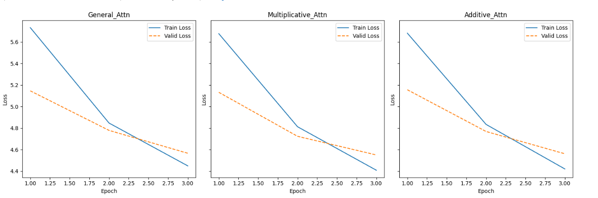
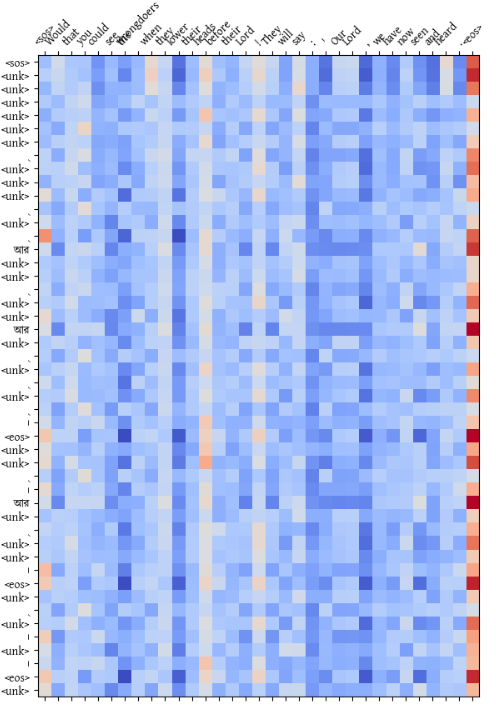
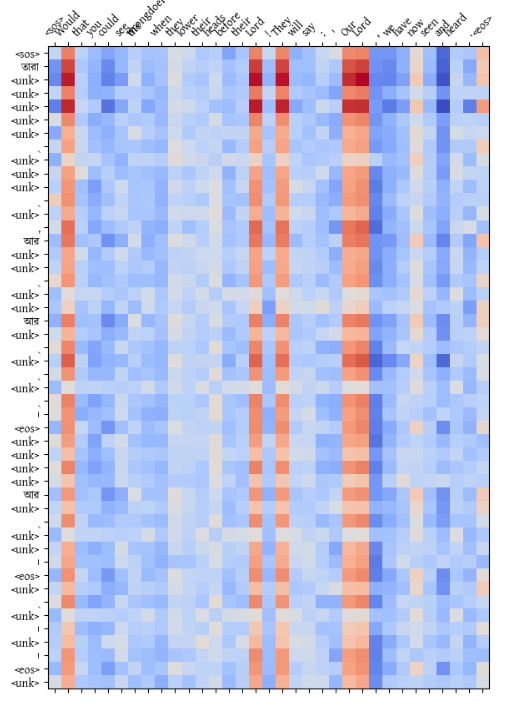
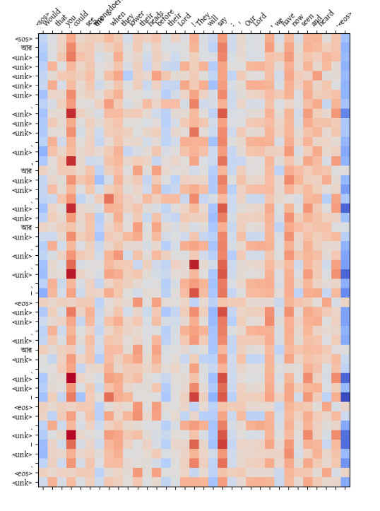
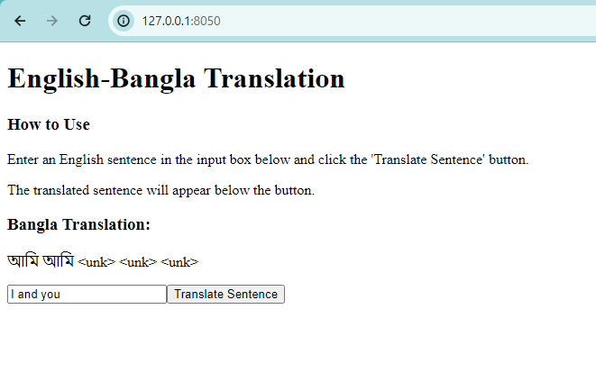

# Machine Translation with Transformer Models

This project implements a machine translation system using Transformer models to translate between English and Bengali. The focus is on experimenting with different attention mechanisms to enhance translation quality.

## Tools and Libraries Used

- **spaCy**: Used for text normalization and tokenization, leveraging the multi-language capabilities of the `xx_ent_wiki_sm` model. ([spaCy](https://spacy.io/))
- **PyTorch**: Serving as the primary framework for model implementation and training. ([PyTorch](https://pytorch.org/))

## Task 1: Get Language Pair

### Dataset Selection

- **Source**: OPUS-100 Corpus
- **Language Pair**: English and Bengali
- **Credit**: The dataset is sourced from [OPUS-100 Corpus](https://opus.nlpl.eu/opus-100.php), and we acknowledge their contribution to making this valuable resource available to the public.

### Dataset Preparation

The dataset preparation involves several key stages to cater to the specific requirements of English and Bengali languages:

1. **Text Normalization**: Using `spaCy` with the `xx_ent_wiki_sm` model for preliminary text cleaning and normalization.
2. **Tokenization**: Employing `spaCy` and its `xx_ent_wiki_sm` model for tokenizing text in both languages.
3. **Vocabulary Building**: Constructing a comprehensive vocabulary for each language, including special tokens for sentence management and numerical representation.
4. **Numericalization**: Converting tokenized text into numeric sequences aligned with the constructed vocabulary.
5. **Sequence Padding**: Padding sequences to ensure uniform length within each batch, facilitating efficient model processing.
6. **Batch Preparation**: Grouping prepared sequences into batches, ready for model training and evaluation.
7. **Attention Masking**: Generating masks to prevent the model from attending to padded positions, enhancing translation focus and accuracy.

## Task 2: Experiment with Attention Mechanisms

Details about implementing and experimenting with different attention mechanisms (General, Multiplicative, Additive) in the Transformer model.

## Task 3: Evaluation and Verification

### 1. Performance Comparison

The performance of each attention mechanism within our Transformer model was rigorously evaluated across several metrics, including validation loss, test loss, perplexity (PPL), and computational efficiency measured by average epoch time. Below are the summarized results:

### Performance Metrics

| Attention Type      | Epoch with Lowest Validation Loss | Lowest Validation Loss |
|---------------------|-----------------------------------|------------------------|
| General_Attn        | 3                                 | 4.566                  |
| Multiplicative_Attn | 3                                 | 4.551                  |
| Additive_Attn       | 3                                 | 4.561                  |

### Computational Efficiency

| Attention Type      | Average Epoch Time (seconds) |
|---------------------|-------------------------------|
| General_Attn        | 579.000                       |
| Multiplicative_Attn | 540.667                       |
| Additive_Attn       | 552.000                       |

### Test Set Evaluation

The final evaluation on the test set provides insights into the model's ability to generalize and its performance on unseen data:

| Attention Type      | Number of Test Data | Test Loss | Test PPL  |
|---------------------|---------------------|-----------|-----------|
| General_Attn        | 600                 | 8.002     | 2986.52   |
| Multiplicative_Attn | 600                 | 7.881     | 2647.46   |
| Additive_Attn       | 600                 | 4.514     | 91.254    |

### 2. Performance Plots
Performance plots showing training and validation loss for each type of attention mechanism (General, Multiplicative, Additive) to visualize and compare learning curves.

### 3. Attention Maps
Displaying attention maps generated by the model to understand how it focuses on different parts of the input sequence while generating translations.

### 4. Analysis
The results indicate that while each attention mechanism offers competitive validation loss, the Additive Attention mechanism significantly outperforms the others in terms of test loss and perplexity, suggesting better generalization and efficiency in handling the translation task.

## Task 4: Machine Translation - Web Application Development

A simple web application showcasing the capabilities of the language model in machine translation:

1. Features an input box where users can enter a sentence or phrase in a source language.
2. Generates and displays the translated version in a target language based on the input.
3. Provides documentation on how the web application interfaces with the language model for machine translation.

## How to Run the Web Application

### Step 1: Install Dash

Make sure you have Dash installed in your Python environment. You can install Dash using pip:

pip install dash

### Step 2: Run the Web Application

Once Dash is installed, navigate to the directory where your Dash application code is located using the command line or terminal. Then, run the following command:

python main.py

### Step 3: Access the Web Application

After running the command, the web application will start running locally. You can access it by opening a web browser and navigating to [http://127.0.0.1:8050/](http://127.0.0.1:8050/) or [http://localhost:8050/](http://localhost:8050/).

Following these steps should allow users to install Dash, run the web application, and access it locally at [http://127.0.0.1:8050/](http://127.0.0.1:8050/). 
